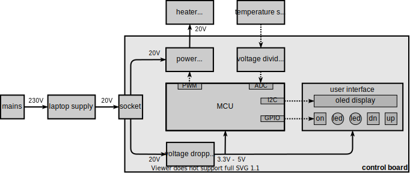
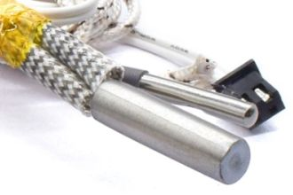
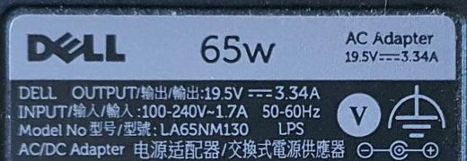
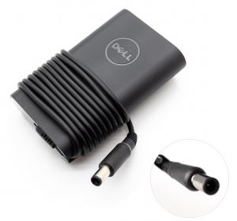
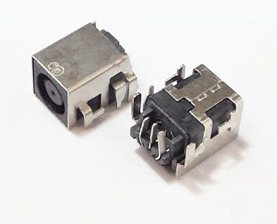
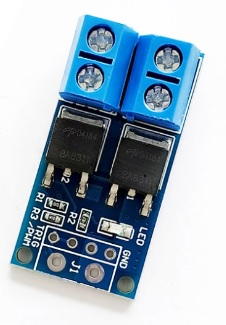
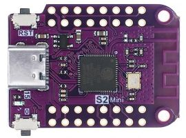
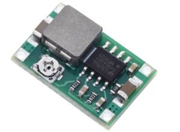
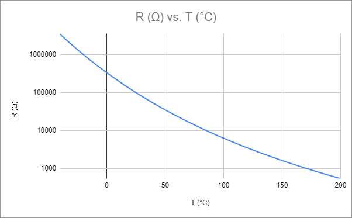

# Electrical design
This document describes the design of electronics of the Filament Fuser.

## System overview
The diagram below shows the system components.

## System components
Each of the system components is detailed below.

### Heater resistor
The heater resistor is a component used in 3D printers.
It typically uses [24V and 50W](https://www.aliexpress.com/item/1005003768579174.html).
It is the big cylinder in the photo below.

## Laptop supply
To power this, we will use a laptop power adapter, for example, a 
[Dell supply with 4.5mm barrel](https://www.dell.com/en-us/shop/dell-45mm-barrel-65w-power-adapter/apd/492-bbme).
These typically deliver 19.5V and 65W. 

. 

## Supply socket
I hope the get a socket for the barrel plug.
Not sure if this one is [correct](https://www.aliexpress.com/item/4000251573706.html).

## Power switcher
To control the temperature, we will PWM the power to the heater resistor.
Since we have around 3A to switch, we use a [MOSFET power switcher](https://www.aliexpress.com/item/1005004840181636.html).

The specifications look ok:
- switchable power 5V-36V DC, continuous current 15A
- trigger signal 3.3V-20V (can be connected to the micro controller IO port)
- can be connected to the PWM signal, frequency 0-20kHz

## MCU
As a micro controller, a good candidate is an ESP32, it has a 12 bit ADC which is helpful
for accurately measuring the temperature. A nice one is an [entry level ESP](https://www.aliexpress.com/item/1005004344359250.html),
it has a small PCB.

Notes 
- [ESP32 S2 mini](https://www.wemos.cc/en/latest/s2/s2_mini.html) homepage
- [its schematics](https://www.wemos.cc/en/latest/_static/files/sch_s2_mini_v1.0.0.pdf)
- One important observation is that the 5V pin from the USB connector is hooked 
  to the net VBUS, which not only routes to the on-board 5V-to-3V dropper (ME6211C33),
  but also directly to a PCB pin labeled VBUS. In other words we can use this pin
  as voltage-in from our 20V-to-5V dropper.
- The 3.3V of the on-board dropper is exposed as a PCB output pin, 
  so we can use that for the user interface elements.
- [ME6211C33 datasheet](https://datasheet.lcsc.com/szlcsc/Nanjing-Micro-One-Elec-ME6211C33M5G-N_C82942.pdf)
  which has an input range of 2V-6V and a maximum output current of 500mA.

## Voltage dropper
The whole control board will only be powered via the laptop adapter, so we need a voltage dropper.
I had a [step down module](https://www.aliexpress.com/item/32723869152.html) in my parts collection
that can drop 20V to 5V.

The specifications look ok:
- input 4.75V to 23V
- output 1.0V to 17V, continuous current 1.8A 

## Temperature sensor
As a temperature sensor we take an NTC that comes with 
the [heater resistor](https://www.aliexpress.com/item/1005003768579174.html).
It is the small cylinder in the photo below.

Notes
- this is a HT-NTC100K thermistor
- possible [datasheet](https://datasheetspdf.com/pdf-file/944190/Danfoss/NTC100K/1)
- resistance at 25°C is 100kΩ, at 200°C it is 558Ω

## Voltage divider
To readout the NTC we probably need a voltage divider, which is a single resistor.

## User interface
For the user-interface we plan the following elements and behavior.

- A small [OLED display](https://www.aliexpress.com/item/1005001985577290.html) that shows the current temperature of the heater.
- A down and an up button to control the setpoint (from 30°C  to 250°C).
  If the down or up [button](https://www.aliexpress.com/item/1005003015037539.html) is pressed while the OLED shows the current temperature
  the OLED will switch to showing the setpoint.
  If the down or up button is pressed while the OLED shows the setpoint, 
  the setpoint is changed (by one degree for a single press, or running if kept pressed).
  The OLED will switch back to showing the current heater temperature when the
  up or down is not pressed for say 3 seconds.
- A green ready [LED](https://www.aliexpress.com/item/32980251862.html) that lights up when the current heater temperature is
  approximately equal to the setpoint. This indicates that the fuser can be used.
- A heater mode button ("on") with a mode LED. 
  When the mains power is plugged-in the controller will boot.
  It will show the current heater temperature
  (typically room temperature of 25°C), it will have a default setpoint 
  (typically PLA melting point of 210°C), but the heater mode will be off.
  
  The heater mode is indicated with the red heater LED; LED off means heater mode is off. 
  When the heater mode button is pressed, the heater mode toggles (and thus the LED). 
  When it is on, the MCU will actively control the heater, probably using a PID loop
  which controls the PWM signal to the heater. This ensures the heater temperature 
  is driven to the setpoint. 
  
  In other words, the mode LED shows the PID is active.
  It does not indicate the heater is driven (its temperature might be higher then the setpoint).
  It does not indicate the heater is hot. Just after switching the mode on, 
  the LED is on but the heater is still cold. Just after switching the mode off,
  the LED is off, but the heater is still hot.
  
  For safety, maybe we let the red LED blink when heater mode is off, 
  but temperature is above 30°C.

(end)

